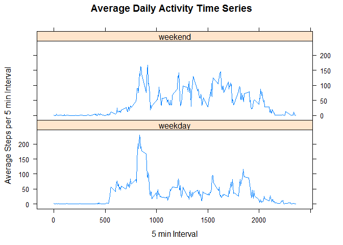

# Reproducible Research: Peer Assessment 1


## Loading and preprocessing the data


```r
#read the data
df<-read.csv("./Data/activity.csv")
head(df)
```

```
##   steps       date interval
## 1    NA 2012-10-01        0
## 2    NA 2012-10-01        5
## 3    NA 2012-10-01       10
## 4    NA 2012-10-01       15
## 5    NA 2012-10-01       20
## 6    NA 2012-10-01       25
```

## What is mean total number of steps taken per day?

2. Histogram of the total number of steps taken each day

```r
#convert date to factor
df$date<-as.factor(df$date)
#take step totals
stepsums<-by(df$steps,df$date,function(x) sum(x,na.rm=TRUE))
hist(stepsums,breaks=10,main='Histogram: Total Number of Steps Per Day',xlab='Total Numer of Steps Per Day')
```


3. Mean and median number of steps taken each day

```r
meansteps<-mean(stepsums[!is.na(stepsums)])
#mean
meansteps
```

```
## [1] 9354.23
```

```r
#median
medsteps<-median(stepsums[!is.na(stepsums)])
medsteps
```

```
## [1] 10395
```

## What is the average daily activity pattern?

4. Time series plot of the average number of steps taken

```r
#convert interval to factor variable
df$interval<-as.factor(df$interval)

#take mean by interval
intavgs<-by(df$steps,df$interval,function(x) mean(x,na.rm=TRUE))

#plot time series
plot(as.numeric(levels(df$interval)),intavgs,type='l',main='Average Daily Activity Time Series',xlab='5 min Interval', ylab='Average Steps per 5 min Interval')
```


5. The 5-minute interval that, on average, contains the maximum number of steps

```r
#calculate the max
maxint<-max(intavgs)
maxint
```

```
## [1] 206.1698
```


## Imputing missing values
In order to impute missing values, each missing point is replaced with the mean of the interval corresponding to the NA point is taken across all days.

6. Code to describe and show a strategy for imputing missing data

```r
numna<-sum(is.na(df$steps))
numna
```

```
## [1] 2304
```

```r
imputed<-apply(df,1,function(x) if (is.na(x['steps'])==TRUE) intavgs[names(intavgs)==x['interval']] else x['steps'])
imputed<-round(as.numeric(imputed),0)
```

7. Histogram of the total number of steps taken each day after missing values are imputed

```r
#count the totoals
imputedstepsums<-by(imputed,df$date,sum)
hist(imputedstepsums,breaks=10,main='Histogram: Total Number of Steps Per Day With Imputed Data',xlab='Total Numer of Steps Per Day With Imputed Data')
```


## Are there differences in activity patterns between weekdays and weekends?


```r
#define days factor variable
days<-weekdays(as.Date(df$date))
weekenddex<-days=='Sunday'|days=='Saturday'
days[!weekenddex]='weekday'
days[weekenddex]='weekend'
days<-as.factor(days)
df$days<-days
df$imputed<-imputed
df$interval<-as.numeric(as.character(df$interval))

#take the means
avgs<-aggregate(imputed ~ interval + days, df, mean)

#plot the means
require(lattice)
```

```
## Loading required package: lattice
```

```r
xyplot(avgs$imputed~avgs$interval|avgs$days,type='l',layout=c(1,2),main='Average Daily Activity Time Series',xlab='5 min Interval', ylab='Average Steps per 5 min Interval')
```




It appears that there's more activity earlier in the day during the weekdays but greater activity overal during the weekend.
